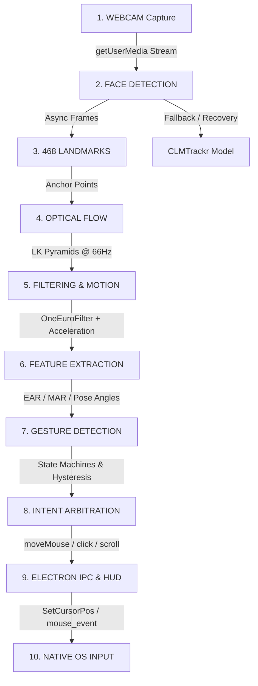

# V.I.S.I.O.N. — Complete System & Repository Audit (Phase 0)

**Project Name**: V.I.S.I.O.N. (Vital Independence System for Individuals with Outstanding Needs)  
**Repository**: `arjavnotfound/VISION-Research-Prototype`  
**Active Branch**: `vision-research-upgrade`  
**Base Commit**: `08d329d Initial commit – V.I.S.I.O.N. Screening Prototype (Event Expo)`  
**Audit Environment**: Node.js `v24.20.0`, npm `11.19.0`, Electron `v31.7.7`, Windows 11 (x64)  
**Disciplines**: Senior Software Engineer, Computer Vision Engineer, Accessibility Engineer, Electron Engineer, QA Engineer, Performance Engineer, Research Engineer, UX Engineer  

---

## 1. End-to-End Runtime Pipeline Trace

Every user interaction flows through a ten-stage pipeline from physical webcam capture to native OS input injection:

### Stage 1: WEBCAM (`getUserMedia`)
- **File**: `core/vision.js:3210-3257`
- **Mechanism**: Calls `navigator.mediaDevices.getUserMedia({ video: { width: 640, height: 480, facingMode: "user" } })`.
- **Lifecycle**: Three-phase acquisition (`tryPreferredCamera` -> `justGetPermission` -> `retryPreferredCamera`).
- **State Transition**: `useCameraButton.hidden = false` $\rightarrow$ User / Auto-Init $\rightarrow$ Video Stream Attached to hidden `<video>` element (`cameraVideo`).

### Stage 2 & 3: FACE DETECTION & LANDMARKS (MediaPipe Face Mesh + CLMTrackr)
- **Files**: `core/vision.js:3622-3735`, `core/lib/face_mesh/face_mesh.js`, `core/lib/clmtrackr.js`
- **Primary Model**: `@tensorflow-models/face-landmarks-detection` using MediaPipe Face Mesh (`refineLandmarks: true`, 468 3D keypoints). Runs asynchronously on WebGL2.
- **Fallback Model**: Legacy `clmtrackr.js` (2.4 MB Constrained Local Model). If Face Mesh fails to load, crashes, or loses WebGL context, the system falls back to CLMTrackr on CPU.
- **Key Landmarks Extracted**:
  - Forehead: Keypoint `10`
  - Nose Base: Keypoint `2`
  - Cheeks: Keypoint `454` (Left) and `234` (Right)
  - Nostrils: Left/Right corners
  - Eyelids: `leftEyeUpper0`, `leftEyeLower0`, `rightEyeUpper0`, `rightEyeLower0`
  - Lips: `lipsUpperInner`, `lipsLowerInner`
  - Eyebrows: `leftEyebrowUpper`, `rightEyebrowUpper`

### Stage 4 & 5: TRACKING & FILTERING (JSFeat Optical Flow + OneEuroFilter)
- **Files**: `core/vision.js:3406-3530` (`class OOPS`), `core/vision.js:3756-3866`, `core/vision.js:4515-4645`
- **Optical Flow**: JSFeat Lucas-Kanade pyramid optical flow (`calcOpticalFlowPyrLK`) runs inside a 15ms `setInterval` loop (~66.6 Hz).
- **Point Seeding & Culling**: Points are seeded on rigid facial structures (nostrils, nasal bridge). Eyelids and lips are culled via `regionFilter()` to prevent blinking and jaw movement from destabilizing cursor position.
- **Motion Integration**: `pointTracker.getMovement()` calculates mean $\Delta X, \Delta Y$ across tracked points.
- **Acceleration Curve**: Power-law velocity curve: $\text{delta} \times (|\text{delta} \times 5|)^{\text{acceleration}}$.
- **Deadzone / Motion Threshold**: Instantaneous movements smaller than `headTrackingMinDistance` are clamped to zero to prevent tremor/jitter.
- **Drag Prevention Delay**: Disables pointer motion for `delayBeforeDragging` milliseconds immediately following a `mouseDown`.
- **Head Tilt Integration**: Pitch, Yaw, and Roll angles calculated via `Math.atan2` on 3D landmark deltas and smoothed using `OneEuroFilter(freq=60, mincutoff=0.01, beta=5.0, dcutoff=0.7)`. When enabled, head tilt applies a linear bias toward the target screen coordinate.

### Stage 6 & 7: FEATURE EXTRACTION & GESTURE DETECTION
- **Files**: `core/vision.js:3869-4165`
- **Blink / Wink (EAR)**: Computes Eye Aspect Ratio via `signedDistancePointLine` from eyelid contours to eye corners.
  - Dual-threshold hysteresis: `thresholdHigh = 0.20`, `thresholdLow = 0.16`.
  - Involuntary blink filter: Rejects closures under 100ms (`blinkRejectDuration`).
  - Modes: Left eye active = Left Click; Right eye active = Right Click.
- **Mouth Open / Jaw Drop (MAR)**: Computes inner lip separation ratio.
  - Hysteresis: `thresholdHigh = 0.25`, `thresholdLow = 0.15`.
  - Dispatches primary click or initiates mouth-open vertical scrolling.
- **Eyebrow / Forehead Raise**: Measures vertical eyebrow distance normalized to inter-ocular baseline (`refScale = eyeDistance`).
  - Neutral baseline $\sim 0.20-0.24$; Raised threshold $> 0.28$ (low threshold $0.24$).
  - Continuous 3-second hold accumulator opens the Windows On-Screen Keyboard (`osk.exe`).
- **Sleep / Standby Mode**: Bilateral eye closure held continuously for 2.0 seconds (`sleepGestureEyesClosedDuration`) toggles tracking standby (`paused = !paused`).
- **Mouth-Open Tilt Scrolling**: Jaw open + Head Pitch $> +5^\circ$ triggers scroll UP; Pitch $< -5^\circ$ triggers scroll DOWN.

### Stage 8 & 9: INTENT ARBITRATION, ELECTRON IPC & HUD
- **Files**: `core/vision.js:4653-4720`, `desktop-app/src/preload-app-window.js`, `desktop-app/src/electron-main/electron-main.js`
- **Position Dispatch**: Renderer invokes `window.electronAPI.moveMouse(~~mouseX, ~~mouseY)` via IPC `moveMouse`.
- **Button Dispatch**: Gestures invoke `window.electronAPI.setMouseButtonState(buttonIndex, down)`.
- **Scroll Dispatch**: Tilt invokes `window.electronAPI.scrollMouse(deltaY)`.
- **Dwell Clicking**: Handled by the transparent screen overlay window (`screen-overlay.js`). An invisible button covers the virtual screen; hovering within a target radius for 500ms triggers `mouseClick(x, y)`.
- **Manual Takeback**: Physical mouse movements $> 10\text{px}$ (`thresholdToRegainControl`) pause camera tracking for 2000ms (`regainControlForTime`).

### Stage 10: NATIVE OS INPUT
- **Files**: `desktop-app/src/electron-main/input-driver.js`, `win-relative-mouse.js`
- **Windows FFI Driver**: Calls `user32.dll` via `koffi`:
  - Cursor Positioning: `SetCursorPos(x, y)`
  - Button Down/Up: `mouse_event(MOUSEEVENTF_LEFTDOWN / UP, 0, 0, 0, 0)`
  - Keyboard Injection: `keybd_event(vk, 0, 0 / KEYEVENTF_KEYUP, 0)` (used for PageUp/PageDown scrolling)
- **Fallback**: Uses `serenade-driver` native C++ addon if compiled.

---

## 2. Complete Component & Defect Matrix

Every audited item is classified into one of five rigorous statuses:
- `[CONFIRMED PROBLEM]`: Verified via code trace or test reproduction.
- `[POSSIBLE PROBLEM]`: Theoretical vulnerability or edge case identified in code.
- `[NOT VERIFIED]`: Requires dedicated hardware, external dependencies, or live sessions to prove.
- `[WORKING]`: Operates correctly according to code inspection.
- `[NOT TESTED]`: Complete lack of test harnesses or validation suites.

### 2.1 Critical Bugs & Scoping Faults

| Component / Subsystem | Code Reference | Classification | Technical Description | Impact |
|:---|:---|:---|:---|:---|
| **Mouse Tilt Scrolling** | `desktop-app/src/electron-main/electron-main.js:1212` | `[CONFIRMED PROBLEM]` | `ipcMain.handle('scrollMouse')` references `isClickingAllowed()`, but `isClickingAllowed` is scoped inside `app.on('ready')` (line 693). | Calling `scrollMouse` throws `ReferenceError: isClickingAllowed is not defined`, crashing the scroll action. |
| **Mouse Button Stuck State** | `desktop-app/src/electron-main/electron-main.js:735-758` | `[CONFIRMED PROBLEM]` | When `isClickingAllowed()` becomes false (e.g. tracking paused, F9 pressed, physical mouse moved, window closed), `setMouseButtonState` returns early at line 737. If a button was held down (`buttonStates.left === true`), the `mouseUp` call is rejected and the native OS mouse remains stuck down. | User's operating system mouse gets permanently stuck in drag/down state until physical mouse is clicked. |
| **Hard Process Termination** | `desktop-app/src/electron-main/electron-main.js:509` | `[CONFIRMED PROBLEM]` | `appWindow.on('closed', () => { app.exit(); })` terminates Electron immediately without calling `beforeunload`, `unload`, `before-quit`, or `will-quit`. | Active native mouse clicks or background workers are not cleanly released on application close. |
| **Camera Stream Race Condition** | `core/vision.js:3200-3254` | `[CONFIRMED PROBLEM]` | Overlapping calls to `Vision.useCamera()` do not cancel or await pending `getUserMedia` promises. Multiple MediaStreams can be requested simultaneously without stopping existing tracks. | Leaked webcam hardware locks; `NotReadableError: Webcam is already in use`. |
| **Automated Testing** | Entire Repository | `[CONFIRMED PROBLEM]` | Zero unit tests, zero integration tests, zero end-to-end tests exist in the entire codebase. | Every code modification carries an uncontrolled risk of silent regression. |

### 2.2 Performance & Resource Bottlenecks

| Component / Subsystem | Code Reference | Classification | Technical Description | Impact |
|:---|:---|:---|:---|:---|
| **High-Frequency Overlay Polling** | `desktop-app/src/electron-main/electron-main.js:589` | `[CONFIRMED PROBLEM]` | `monitorMousePosition` executes every 10ms (100 Hz), calling Win32 `GetCursorPos` and sending full `overlayUpdate` IPC payloads to the overlay window on every tick. | Excessive CPU utilization and IPC serialization overhead even when the system is idle. |
| **DOM Thrashing in Overlay** | `core/vision.js:5118-5122` | `[CONFIRMED PROBLEM]` | On every 100 Hz overlay update, inline CSS radial-gradient strings are generated and assigned to `el.style.maskImage` and `webkitMaskImage` on DOM nodes. | Continuous layout recalculation and GPU style re-parsing on the overlay layer. |
| **Point Tracker O(N²) Allocations** | `core/vision.js:3465-3471` | `[CONFIRMED PROBLEM]` | `prunePoints()` generates dynamic string keys into `grid = {}`, calls `Object.values(grid)`, and invokes `indexesToKeep.includes()` inside an O(N) loop every single frame (66.6 Hz). | Constant garbage collection (GC) pressure and micro-stutter in the tracking loop. |
| **Animation Loop Timer** | `core/vision.js:4802` | `[POSSIBLE PROBLEM]` | Tracking loop uses `setInterval(..., 15)` rather than adaptive scheduling or `requestAnimationFrame`. | Can drift depending on OS timer resolution and causes continuous CPU load when backgrounded. |

### 2.3 Computer Vision & Tracking Mechanics

| Component / Subsystem | Code Reference | Classification | Technical Description | Impact |
|:---|:---|:---|:---|:---|
| **Facial Region Filtering** | `core/vision.js:3756-3804` | `[WORKING]` | Elliptical exclusion zone around mouth inner lips and outer eye corners prevents jaw drops and blinks from skewing optical flow coordinates. | Stabilizes cursor when user performs facial action words. |
| **Head Pose Calculation** | `core/vision.js:3825-3866` | `[WORKING]` | Pitch, yaw, and roll derived from 3D Face Mesh keypoints [10], [2], [454], [234] with OneEuroFilter smoothing. | Provides smooth angular orientation signals for tilt control. |
| **Involuntary Blink Suppression** | `core/vision.js:3973-3985` | `[WORKING]` | 100ms duration gate rejects natural unconscious blinks while registering deliberate winks. | Reduces accidental clicks during normal eye blinking. |
| **Low-Light / Distance Handling** | `core/vision.js:5094-5097` | `[NOT TESTED]` | Diagnostics for low illumination, face too far from camera, or face partly out of frame are stubbed as TODOs without active detection. | Tracking degrades gracefully to CLMTrackr or halts, but user receives minimal corrective feedback. |
| **Multi-Face Interference** | `core/vision.js:3715` | `[POSSIBLE PROBLEM]` | `facemeshPrediction = predictions[0]` blindly binds to the first detected face without tracking persistent face IDs. | If another person enters the camera frame, tracking may abruptly jump to the second face. |

### 2.4 Interaction, Dwell Clicking & Accessibility

| Component / Subsystem | Code Reference | Classification | Technical Description | Impact |
|:---|:---|:---|:---|:---|
| **F9 Global Hotkey** | `desktop-app/src/electron-main/electron-main.js:898-904` | `[WORKING]` | Electron `globalShortcut.register('F9')` broadcasts toggle command to renderer to start/pause tracking. | Essential accessibility failsafe allowing emergency pause. |
| **Physical Mouse Takeover** | `desktop-app/src/electron-main/electron-main.js:610-626` | `[WORKING]` | Detects physical cursor movement > 10px from history buffer and halts vision control for 2 seconds. | Prevents fighting between head tracker and companion/caregiver using a hardware mouse. |
| **Desktop Dwell Drag Missing** | `desktop-app/src/screen-overlay.js:19-28` | `[CONFIRMED PROBLEM]` | Desktop overlay initializes dwell clicking with only `click` configured; `shouldDrag` and `isHeld` are omitted. | Users relying entirely on dwell clicking cannot perform drag-and-drop actions in Windows. |
| **Screen Edge Trapping** | `core/vision.js:4643-4644` | `[POSSIBLE PROBLEM]` | Position is clamped strictly to `[screenOffsetX, screenOffsetX + screenWidth]`. Optical flow points can drift when cursor is pinned against screen boundary. | Re-centering from screen edges may require exaggerated counter-movement (hysteresis drift). |
| **Multi-Monitor Display Offsets** | `desktop-app/src/electron-main/electron-main.js:234-240` | `[NOT VERIFIED]` | Virtual display bounds calculation sums spans across all screens. Negative coordinate offsets on secondary monitors placed to the left or top need physical validation. | Cursor mapping could misalign on complex multi-monitor layouts. |

### 2.5 Security, Privacy & Third-Party Attribution

| Component / Subsystem | Code Reference | Classification | Technical Description | Impact |
|:---|:---|:---|:---|:---|
| **Hardcoded Upstream Sentry DSN** | `desktop-app/src/electron-main/electron-main.js:19-22` | `[CONFIRMED PROBLEM]` | Sentry error reporting is hardcoded to an external upstream project DSN (`o4507120033660928.ingest.us.sentry.io`). | Unvetted network transmission of application crashes and system metadata to third-party endpoints. |
| **Upstream Auto-Updater Endpoint** | `desktop-app/src/electron-main/auto-updater.js:7` | `[CONFIRMED PROBLEM]` | Auto-updater queries `1j01/vision` GitHub releases rather than the V.I.S.I.O.N. research repository. | Potential update failure or unauthorized replacement of application binaries. |
| **Native Build Dependency Failure** | `desktop-app/package.json:49` | `[CONFIRMED PROBLEM]` | Native addon compilation (`node-gyp rebuild` for `win_relative_mouse`) fails on systems without Visual Studio C++ toolchains. Untracked Koffi driver currently bridges this gap. | Fresh clones fail standard npm install unless build scripts gracefully fall back. |
| **Third-Party Attribution Integrity** | `package.json:6`, `core/package.json:7-10`, `website/index.html` | `[POSSIBLE PROBLEM]` | Monorepo and package metadata contain mixed identifiers between original upstream project and V.I.S.I.O.N.. | Attribution must be cleanly separated: recognize open-source origins while establishing V.I.S.I.O.N. ownership. |

---

## 3. Inventory of Technical Debt, TODOs & Dead Code

A total of **42 TODO / FIXME / HACK** annotations were audited across active modules:

1. `desktop-app/src/electron-main/electron-main.js:735`: `// TODO: make sure the mouse button is released when disabling clicking ability (including exiting the app, I suppose!)` *(Direct cause of stuck mouse buttons)*.
2. `desktop-app/src/electron-main/electron-main.js:594`: `// TODO: consider postponing getMouseLocation, if possible, to minimize latency...`
3. `desktop-app/src/electron-main/electron-main.js:179`: `// TODO: switch to a more inherently ephemeral communication method, like a pipe or a socket.`
4. `core/vision.js:3201`: `// Q: What happens if there are multiple overlapping calls to useCamera? I don't know. TODO: test this.`
5. `core/vision.js:3532`: `// FIXME: can't click to add points because canvas is covered by .vision-canvas-overlay`
6. `core/vision.js:3901`: `// TODO: move facial gesture recognition code to a separate file`
7. `core/vision.js:4898`: `// TODO: re-structure so that cleanup can succeed even if initialization fails`
8. `core/vision.js:2438`: `// HACK: update localStorage because it's what's used to determine the language`
9. `core/vision.js:2977`: `// HACK: ensure handleInitialLoad is called even for first run`
10. `desktop-app/src/electron-main/menus.js:214`: `app.relaunch(); // overkill! TODO: apply the settings without restarting the app`

---

## 4. Synthesis of Audit Findings

The V.I.S.I.O.N. prototype has demonstrated high technical ingenuity in its core computer vision tracking algorithms. The hybrid coupling of MediaPipe Face Mesh landmark detection with high-speed JSFeat optical flow is effective for real-time hands-free pointing. 

However, the surrounding systems—specifically OS input injection, IPC scoping, error boundaries, process lifecycle, and automated testability—require systematic stabilization before the prototype can be considered calibrated, robust, and research-grade.
